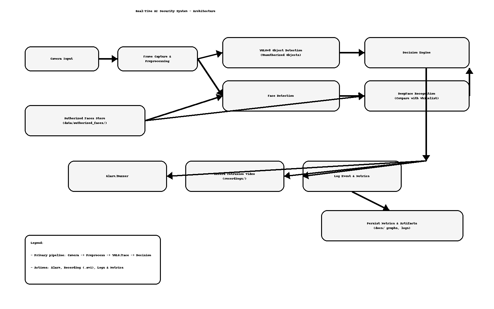
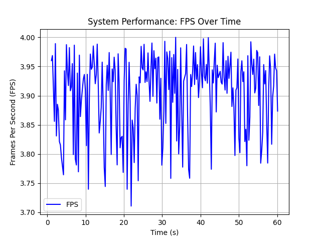
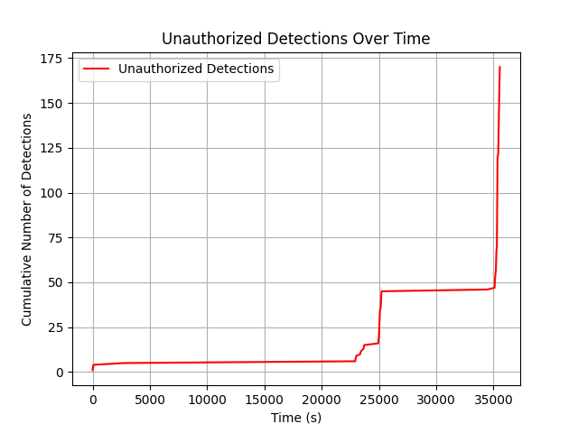
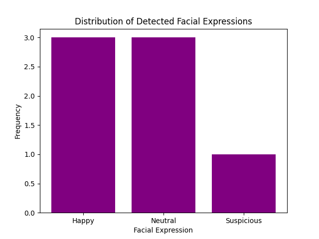
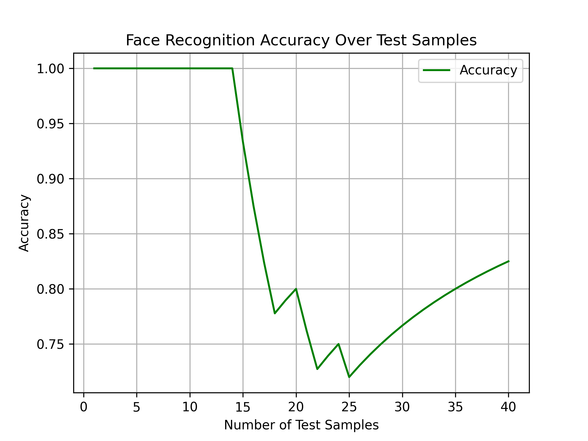
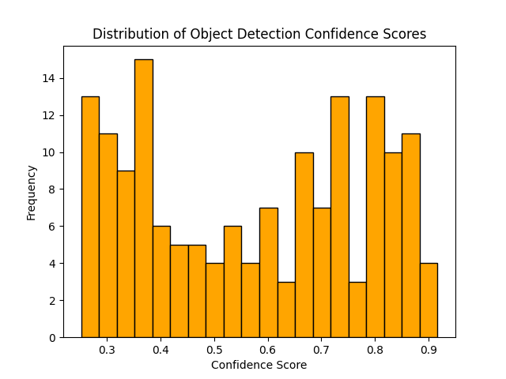
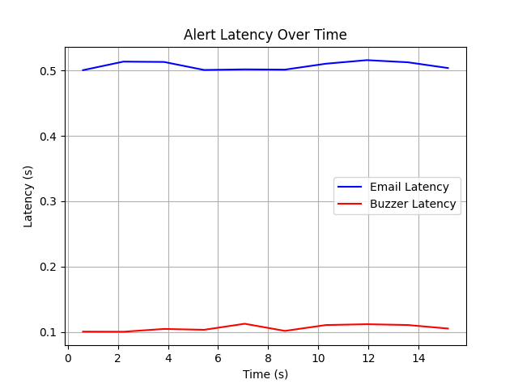
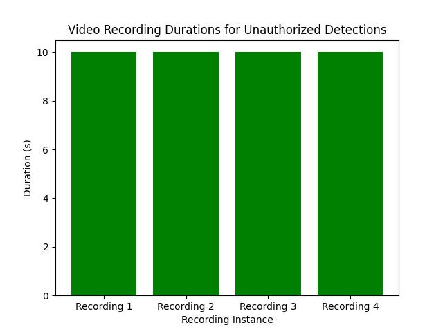

# 🛡️ Real-Time AI Security System  

An AI-powered real-time security system that detects **faces, objects, and unauthorized access** using **YOLOv8 + DeepFace**.  
When an intruder or unknown object is detected, the system raises an **alarm** and records video evidence automatically.  

---

## 🚀 Features
- 🔍 Real-time face recognition (authorized vs unauthorized)  
- 🎯 Object detection with YOLOv8  
- 📹 Automatic recording of intrusions (saved in `recordings/`)  
- 🔔 Instant alarm sound for alerts  
- 🗂️ Supports multiple authorized users  

---

## 🛠️ Tech Stack
- Python  
- PyTorch  
- YOLOv8 (Ultralytics)  
- DeepFace (Face Recognition)  
- OpenCV  

---

## ⚙️ System Design
The high-level pipeline for the Real-Time AI Security System:



- Camera → Frame capture/preprocess  
- YOLOv8 for object detection  
- Face detection → DeepFace recognition vs. authorized whitelist  
- Decision engine triggers: **alarm**, **recording**, **logging**

---

## 📊 Performance & Results

**Throughput**
- Frames per second over time  
  

**Detection Behavior**
- Unauthorized detections over time  
  

**Face Analytics**
- Expression distribution across detections  
  
- Face recognition accuracy  
  

**Model Confidence**
- Confidence scores distribution  
  

**Alerting & Recording**
- End-to-end alert latency  
  
- Recording durations distribution  
  

> Note: graphs are generated from operational logs; values will vary based on environment, camera, and model config.


## ⚡ How to Run
```bash
# 1. Clone the repo
git clone https://github.com/Subrahmanyeswar/AI-Security-System.git
cd AI-Security-System

# 2. Install dependencies
pip install -r requirements.txt

# 3. Run the system
python main.py
